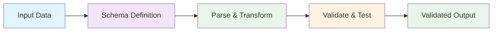
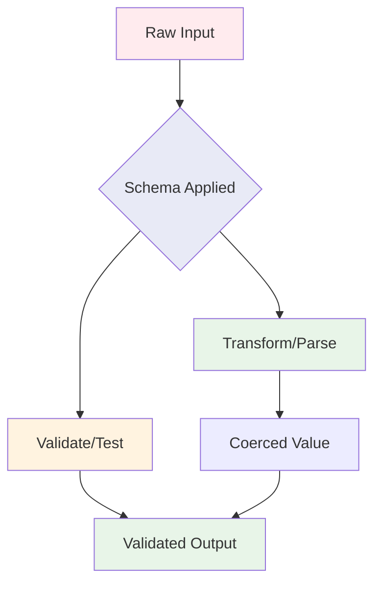
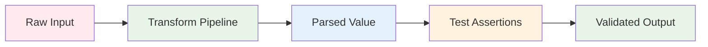

# 🚀 TriVali – **Trigger & Validate Schema Effortlessly**

*Runtime Schema Validation & Transformation Engine*

> **Define → Transform → Validate → Trust**

*(Pronounced: "Tri" like "trigger", "Vali" like "validation")*

<a aria-label="KhulnaSoft logo" href="https://khulnasoft.com">
  
</a>
<a aria-label="NPM version" href="https://www.npmjs.com/package/trivali">
  
</a>
<a aria-label="License" href="https://github.com/khulnasoft-bot/trivali/blob/main/LICENSE">
  
</a>
<a aria-label="CI status" href="https://github.com/khulnasoft-bot/trivali/actions/workflows/ci.yml?query=event%3Apush+branch%3Amain">
  
</a>
<a aria-label="TypeScript" href="http://www.typescriptlang.org/">
  
</a>
<a aria-label="Downloads" href="https://www.npmjs.com/package/trivali">
  
</a>

---

## 📊 **At a Glance**

| Feature | Status | Performance | Type Safety |
|---------|--------|-------------|-------------|
| **Runtime Validation** | ✅ | ⚡ Lightning Fast | 🔒 Full TypeScript Support |
| **Async Support** | ✅ | 🚀 Non-blocking | 🎯 Type Inference |
| **Custom Methods** | ✅ | 🛠️ Extensible | 🔧 Developer Friendly |
| **Error Handling** | ✅ | 📍 Detailed Messages | 🎨 Rich Metadata |

---

## 🎯 **Why TriVali?**

**TriVali** is a runtime schema builder for value parsing and validation. With **TriVali**, you can define a schema, transform a value to match the schema, assert the shape of an existing value, or both. **TriVali** schemas are powerful, highly expressive, and allow modeling of complex, interdependent validations and transformations for your data.



---

### **🔥 Killer Features of TriVali:**

| Feature | Description | Benefit |
|---------|-------------|---------|
| **🎨 Concise & Expressive Interface** | Clean and intuitive schema API | **Developer Productivity** 🚀 |
| **🔒 Powerful TypeScript Support** | Auto-infer types & ensure correctness | **Type Safety** 🛡️ |
| **⚡ Built-in Async Validation** | Seamlessly handle async operations | **Performance** ⚡ |
| **🔧 Extensible & Customizable** | Add type-safe methods & schemas | **Flexibility** 🔧 |
| **📝 Rich Error Details** | Detailed, actionable error messages | **Better Debugging** 🐛 |

---

## 🚀 **Getting Started with TriVali**

### **Installation**

```bash
# npm
npm install trivali

# yarn
yarn add trivali

# pnpm
pnpm add trivali
```

### **Quick Start**

Schemas in **TriVali** are comprised of parsing actions (transforms) and assertions (tests) about input values. You can validate input values by parsing them and running a configured set of assertions. The schema-building process is fluent and allows for method chaining.

### **📝 Example: User Schema Validation**

```typescript
import { object, string, number, date, InferType } from 'trivali';

// 🎯 Define a schema for a user object
let userSchema = object({
  name: string().required(),
  age: number().required().positive().integer(),
  email: string().email(),
  website: string().url().nullable(),
  createdOn: date().default(() => new Date()),
});

// ✅ Parse and assert validity of user data
let user = await userSchema.validate(await fetchUser());

// 🔍 Infer the TypeScript type from the schema
type User = InferType<typeof userSchema>;

/* 
  📋 Type User:
  {
    name: string;
    age: number;
    email?: string | undefined;
    website?: string | null | undefined;
    createdOn: Date;
  }
*/
```

### **🔄 How TriVali Works:**



#### **🔧 Value Transformation:**  
Use the schema to **coerce** or **cast** an input value into the correct type. Optionally, transform the value into more specific and concrete values, without making further assertions.

#### **🎯 Casting Example:**

```typescript
// 🔄 Attempts to coerce values to the correct type
let parsedUser = userSchema.cast({
  name: 'jimmy',
  age: '24',
  createdOn: '2014-09-23T19:25:25Z',
});
// ✅  { name: 'jimmy', age: 24, createdOn: Date }
```

#### **🔒 Strict Validation Example:**

Know that your input value is already parsed? You can "strictly" validate an input, and avoid the overhead of running parsing logic.

```typescript
// ❌  ValidationError "age is not a number"
let parsedUser = await userSchema.validate(
  {
    name: 'jimmy',
    age: '24',
  },
  { strict: true },
);
```

---

## 📚 **Table of Contents**

<!-- START doctoc generated TOC please keep comment here to allow auto update -->
<!-- DON'T EDIT THIS SECTION, INSTEAD RE-RUN doctoc TO UPDATE -->

- [🏗️ **Schema Basics**](#-schema-basics)
  - [**📋 Core Concepts**](#-core-concepts)
  - [**🔄 Parsing: Transforms**](#-parsing-transforms)
    - [**🎯 Transform Examples**](#-transform-examples)
    - [**⚡ Transform Pipeline**](#-transform-pipeline)
  - [**🧪 Validation: Tests**](#-validation-tests)
    - [**✅ Basic Test Example**](#-basic-test-example)
    - [**🔧 Custom Test Example**](#-custom-test-example)
    - [**🎯 Advanced Test with Dynamic Errors**](#-advanced-test-with-dynamic-errors)
    - [**🛠️ Customizing Errors**](#-customizing-errors)
  - [**🔄 Composition and Reuse**](#-composition-and-reuse)
    - [**📋 Immutability Example**](#-immutability-example)
    - [**🏗️ Schema Composition Patterns**](#-schema-composition-patterns)
- [🔒 **TypeScript Integration**](#-typescript-integration)
  - [**🎯 Type Safety Features**](#-type-safety-features)
    - [**📝 Basic Type Inference**](#-basic-type-inference)
    - [**🎯 Schema Defaults & Types**](#-schema-defaults--types)
    - [**🔒 Ensuring Schema Matches Existing Type**](#-ensuring-schema-matches-existing-type)
    - [**🔧 Extending Built-in Schema with New Methods**](#-extending-built-in-schema-with-new-methods)
    - [**⚙️ TypeScript Configuration**](#-typescript-configuration)
- [🌍 **Error Message Customization**](#-error-message-customization)
  - [**🎨 Custom Error Messages**](#-custom-error-messages)
    - [**📝 Basic Localization Example**](#-basic-localization-example)
  - [**🌐 Localization and i18n**](#-localization-and-i18n)
    - [**🔧 Advanced i18n Setup**](#-advanced-i18n-setup)
    - [**🌍 Supported Languages Matrix**](#-supported-languages-matrix)
- [📚 **API Reference**](#-api-reference)
  - [**🔧 Core Module (`trivali`)**](#-core-module-trivali)
    - [**📦 Available Imports**](#-available-imports)
    - [**🎯 Utility Functions**](#-utility-functions)
      - [**`reach(schema: Schema, path: string, value?: object, context?: object): Schema`**](#reachschema-schema-path-string-value-object-context-object-schema)
      - [**`addMethod(schemaType: Schema, name: string, method: ()=> Schema): void`**](#addmethodschematype-schema-name-string-method--schema-void)
      - [**`ref(path: string, options: { contextPrefix: string }): Ref`**](#refpath-string-options--contextprefix-string--ref)
      - [**`lazy((value: any) => Schema): Lazy`**](#lazyvalue-any--schema-lazy)
      - [**`ValidationError(errors: string | Array<string>, value: any, path: string)`**](#validationerrorerrors-string--arraystring-value-any-path-string)
  - [**🏗️ Core Schema Class**](#-core-schema-class)
    - [**🔧 Schema Methods Overview**](#-schema-methods-overview)
    - [**📋 Schema Metadata Methods**](#-schema-metadata-methods)
      - [**`Schema.clone(): Schema`**](#schemaclone-schema)
      - [**`Schema.label(label: string): Schema`**](#schemalabellabel-string-schema)
      - [**`Schema.meta(metadata: SchemaMetadata): Schema`**](#schemametametadata-schemametadata-schema)
      - [**`Schema.describe(options?: ResolveOptions): SchemaDescription`**](#schemadescribeoptions-resolveoptions-schemadescription)
    - [`Schema.concat(schema: Schema): Schema`](#schemaconcatschema-schema-schema)
    - [`Schema.validate(value: any, options?: object): Promise<InferType<Schema>, ValidationError>`](#schemavalidatevalue-any-options-object-promiseinfertypeschema-validationerror)
    - [`Schema.validateSync(value: any, options?: object): InferType<Schema>`](#schemavalidatesyncvalue-any-options-object-infertypeschema)
    - [`Schema.validateAt(path: string, value: any, options?: object): Promise<InferType<Schema>, ValidationError>`](#schemavalidateatpath-string-value-any-options-object-promiseinfertypeschema-validationerror)
    - [`Schema.validateSyncAt(path: string, value: any, options?: object): InferType<Schema>`](#schemavalidatesyncatpath-string-value-any-options-object-infertypeschema)
    - [`Schema.isValid(value: any, options?: object): Promise<boolean>`](#schemaisvalidvalue-any-options-object-promiseboolean)
    - [`Schema.isValidSync(value: any, options?: object): boolean`](#schemaisvalidsyncvalue-any-options-object-boolean)
    - [`Schema.cast(value: any, options = {}): InferType<Schema>`](#schemacastvalue-any-options---infertypeschema)
    - [`Schema.isType(value: any): value is InferType<Schema>`](#schemaistypevalue-any-value-is-infertypeschema)
    - [`Schema.strict(enabled: boolean = false): Schema`](#schemastrictenabled-boolean--false-schema)
    - [`Schema.strip(enabled: boolean = true): Schema`](#schemastripenabled-boolean--true-schema)
    - [`Schema.withMutation(builder: (current: Schema) => void): void`](#schemawithmutationbuilder-current-schema--void-void)
    - [`Schema.default(value: any): Schema`](#schemadefaultvalue-any-schema)
    - [`Schema.getDefault(options?: object): Any`](#schemagetdefaultoptions-object-any)
    - [`Schema.nullable(message?: string | function): Schema`](#schemanullablemessage-string--function-schema)
    - [`Schema.nonNullable(message?: string | function): Schema`](#schemanonnullablemessage-string--function-schema)
    - [`Schema.defined(): Schema`](#schemadefined-schema)
    - [`Schema.optional(): Schema`](#schemaoptional-schema)
    - [`Schema.required(message?: string | function): Schema`](#schemarequiredmessage-string--function-schema)
    - [`Schema.notRequired(): Schema`](#schemanotrequired-schema)
    - [`Schema.typeError(message: string): Schema`](#schematypeerrormessage-string-schema)
    - [`Schema.oneOf(arrayOfValues: Array<any>, message?: string | function): Schema` Alias: `equals`](#schemaoneofarrayofvalues-arrayany-message-string--function-schema-alias-equals)
    - [`Schema.notOneOf(arrayOfValues: Array<any>, message?: string | function)`](#schemanotoneofarrayofvalues-arrayany-message-string--function)
    - [`Schema.when(keys: string | string[], builder: object | (values: any[], schema) => Schema): Schema`](#schemawhenkeys-string--string-builder-object--values-any-schema--schema-schema)
    - [`Schema.test(name: string, message: string | function | any, test: function): Schema`](#schematestname-string-message-string--function--any-test-function-schema)
    - [`Schema.test(options: object): Schema`](#schematestoptions-object-schema)
    - [`Schema.transform((currentValue: any, originalValue: any) => any): Schema`](#schematransformcurrentvalue-any-originalvalue-any--any-schema)
- [🎯 **Schema Types Reference**](#-schema-types-reference)
  - [**🔧 Mixed Schema**](#-mixed-schema)
    - [**📋 Mixed Schema Features**](#-mixed-schema-features)
    - [**🔧 Custom Type Implementation**](#-custom-type-implementation)
  - [**📝 String Schema**](#-string-schema)
    - [**🎯 String Schema Methods**](#-string-schema-methods)
    - [**⚙️ String Schema Behavior**](#-string-schema-behavior)
  - [**🔢 Number Schema**](#-number-schema)
    - [**🎯 Number Schema Methods**](#-number-schema-methods)
    - [**⚙️ Number Schema Behavior**](#-number-schema-behavior)
  - [**✅ Boolean Schema**](#-boolean-schema)
  - [**📅 Date Schema**](#-date-schema)
    - [**🎯 Date Schema Methods**](#-date-schema-methods)
    - [**⚙️ Date Schema Behavior**](#-date-schema-behavior)
  - [**📋 Array Schema**](#-array-schema)
    - [**🎯 Array Schema Methods**](#-array-schema-methods)
  - [**📝 Object Schema**](#-object-schema)
    - [**🎯 Object Schema Methods**](#-object-schema-methods)

<!-- END doctoc generated TOC please keep comment here to allow auto update -->

---

## 🏗️ **Schema Basics**

### **📋 Core Concepts**

Schema definitions are comprised of:

| Component | Purpose | Example |
|-----------|---------|---------|
| **🔄 Transforms** | Manipulate inputs into desired shape | `string().lowercase().trim()` |
| **🧪 Tests** | Assert criteria over parsed data | `.min(3).email().required()` |
| **📝 Metadata** | Store schema information | `.label('Email').meta({ key: 'value' })` |



In order to be maximally flexible, **TriVali** allows running both parsing and assertions separately to match specific needs.

### **🔄 Parsing: Transforms**

Each built-in type implements basic type parsing, which comes in handy when parsing serialized data, such as JSON. Additionally types implement type specific transforms that can be enabled.

#### **🎯 Transform Examples**

```typescript
// 🔢 Basic number transformation
let num = number().cast('1'); // 1

// 🎨 String transformations with JSON parsing
let obj = object({
  firstName: string().lowercase().trim(),
})
  .json()
  .camelCase()
  .cast('{"first_name": "jAnE "}'); // { firstName: 'jane' }

// 🔧 Custom transform example
let reversedString = string()
  .transform((currentValue) => currentValue.split('').reverse().join(''))
  .cast('dlrow olleh'); // "hello world"
```

#### **⚡ Transform Pipeline**

Transforms form a "pipeline", where the value of a previous transform is piped into the next one. When an input value is `undefined` **TriVali** will apply the schema default if it's configured.

> ⚠️ **Watch out!** Values are not guaranteed to be valid types in transform functions. Previous transforms may have failed. For example a number transform may receive the input value, `NaN`, or a number.

### **🧪 Validation: Tests**

**TriVali** schema run "tests" over input values. Tests assert that inputs conform to some criteria. Tests are distinct from transforms, in that they do not change or alter the input (or its type) and are usually reserved for checks that are hard, if not impossible, to represent in static types.

#### **✅ Basic Test Example**

```typescript
string()
  .min(3, 'must be at least 3 characters long')
  .email('must be a valid email')
  .validate('no'); // ValidationError
```

#### **🔧 Custom Test Example**

```typescript
let jamesSchema = string().test(
  'is-james',
  (d) => `${d.path} is not James`,
  (value) => value == null || value === 'James',
);

jamesSchema.validateSync('James'); // "James"

jamesSchema.validateSync('Jane'); // ValidationError "this is not James"
```

#### **🎯 Advanced Test with Dynamic Errors**

```typescript
let order = object({
  no: number().required(),
  sku: string().test({
    name: 'is-sku',
    skipAbsent: true,
    test(value, ctx) {
      if (!value.startsWith('s-')) {
        return ctx.createError({ message: 'SKU missing correct prefix' });
      }
      if (!value.endsWith('-42a')) {
        return ctx.createError({ message: 'SKU missing correct suffix' });
      }
      if (value.length < 10) {
        return ctx.createError({ message: 'SKU is not the right length' });
      }
      return true;
    },
  }),
});

order.validate({ no: 1234, sku: 's-1a45-14a' });
```

> 💡 **Heads up:** Unlike transforms, `value` in a custom test is guaranteed to be the correct type (in this case an optional string). It still may be `undefined` or `null` depending on your schema. In those cases, you may want to return `true` for absent values unless your transform makes presence related assertions. The test option `skipAbsent` will do this for you if set.

#### **🛠️ Customizing Errors**

In the simplest case a test function returns `true` or `false` depending on whether the check passed. In the case of a failing test, **TriVali** will throw a [`ValidationError`](#validationerrorerrors-string--arraystring-value-any-path-string) with your (or the default) message for that test. ValidationErrors also contain a bunch of other metadata about the test, including its name, what arguments (if any) it was called with, and the path to the failing field in the case of a nested validation.

Error messages can also be constructed on the fly to customize how the schema fails.

```typescript
// 🎨 Dynamic error creation example
let order = object({
  no: number().required(),
  sku: string().test({
    name: 'is-sku',
    skipAbsent: true,
    test(value, ctx) {
      if (!value.startsWith('s-')) {
        return ctx.createError({ message: 'SKU missing correct prefix' });
      }
      if (!value.endsWith('-42a')) {
        return ctx.createError({ message: 'SKU missing correct suffix' });
      }
      if (value.length < 10) {
        return ctx.createError({ message: 'SKU is not the right length' });
      }
      return true;
    },
  }),
});

order.validate({ no: 1234, sku: 's-1a45-14a' });
```

### **🔄 Composition and Reuse**

Schema are immutable, each method call returns a new schema object. Reuse and pass them around without fear of mutating another instance.

#### **📋 Immutability Example**

```typescript
// 🔧 Create base schema
let optionalString = string().optional();

// 🎯 Extend with defined requirement
let definedString = optionalString.defined();

// ✅ Different behavior for same base
let value = undefined;
optionalString.isValid(value); // true
definedString.isValid(value); // false
```

#### **🏗️ Schema Composition Patterns**

| Pattern | Use Case | Example |
|---------|----------|---------|
| **Base Extension** | Common validation rules | `optionalString.defined()` |
| **Method Chaining** | Complex validation | `string().email().required()` |
| **Schema Reuse** | Shared validation logic | `const userBase = object({...})` |
| **Immutable Updates** | Safe modifications | `schema.clone().required()` |

---

## 🔒 **TypeScript Integration**

### **🎯 Type Safety Features**

| Feature | Description | Benefit |
|---------|-------------|---------|
| **🔍 Auto Type Inference** | `InferType<T>` extracts schema types | **Zero-config typing** ✨ |
| **🛡️ Runtime Validation** | Compile-time + runtime checks | **Double safety** 🛡️ |
| **🔧 Extensible Types** | Interface merging support | **Custom methods** 🔧 |
| **⚡ IntelliSense** | Full editor support | **Better DX** 💻 |

**TriVali** schema produce static TypeScript interfaces. Use `InferType` to extract that interface:

#### **📝 Basic Type Inference**

```typescript
import * as trivali from 'trivali';

let personSchema = trivali.object({
  firstName: trivali.string().defined(),
  nickName: trivali.string().default('').nullable(),
  sex: trivali
    .mixed()
    .oneOf(['male', 'female', 'other'] as const)
    .defined(),
  email: trivali.string().nullable().email(),
  birthDate: trivali.date().nullable().min(new Date(1900, 0, 1)),
});

interface Person extends trivali.InferType<typeof personSchema> {
  // 🎨 using interface instead of type generally gives nicer editor feedback
}
```

#### **🎯 Schema Defaults & Types**

A schema's default is used when casting produces an `undefined` output value. Because of this, setting a default affects the output type of the schema, essentially marking it as "defined()".

```typescript
import { string } from 'trivali';

// ✅ With default - always returns string
let value: string = string().default('hi').validate(undefined);

// ❌ Without default - can return undefined
let value: string | undefined = string().validate(undefined);
```

#### **🔒 Ensuring Schema Matches Existing Type**

In some cases a TypeScript type already exists, and you want to ensure that your schema produces a compatible type:

```typescript
import { object, number, string, ObjectSchema } from 'trivali';

interface Person {
  name: string;
  age?: number;
  sex: 'male' | 'female' | 'other' | null;
}

// ✅ Will raise a compile-time type error if schema does not produce a valid Person
let schema: ObjectSchema<Person> = object({
  name: string().defined(),
  age: number().optional(),
  sex: string<'male' | 'female' | 'other'>().nullable().defined(),
});

// ❌ Type error: "Type 'number | undefined' is not assignable to type 'string'."
let badSchema: ObjectSchema<Person> = object({
  name: number(),
});
```

#### **🔧 Extending Built-in Schema with New Methods**

You can use TypeScript's interface merging behavior to extend the schema types if needed. Type extensions should go in an "ambient" type definition file such as your `globals.d.ts`.

> ⚠️ **Watch out!** Merging only works if the type definition is _exactly_ the same, including generics. Consult the **TriVali** source code for each type to ensure you are defining it correctly

```typescript
// 📁 globals.d.ts
declare module 'trivali' {
  interface StringSchema<TType, TContext, TDefault, TFlags> {
    append(appendStr: string): this;
  }
}

// 📁 app.ts
import { addMethod, string } from 'trivali';

addMethod(string, 'append', function append(appendStr: string) {
  return this.transform((value) => `${value}${appendStr}`);
});

string().append('~~~~').cast('hi'); // 'hi~~~~'
```

#### **⚙️ TypeScript Configuration**

You **must** have the `strictNullChecks` compiler option enabled for type inference to work.

We also recommend settings `strictFunctionTypes` to `false`, for functionally better types. Yes this reduces overall soundness, however TypeScript already disables this check for methods and constructors (note from TS docs):

> During development of this feature, we discovered a large number of inherently unsafe class hierarchies, including some in the DOM. Because of this, the setting only applies to functions written in function syntax, not to those in method syntax.

Your mileage will vary, but we've found that this check doesn't prevent many of real bugs, while increasing the amount of onerous explicit type casting in apps.

---

## 🌍 **Error Message Customization**

### **🎨 Custom Error Messages**

Default error messages can be customized for when no message is provided with a validation test. If any message is missing in the custom dictionary the error message will default to **TriVali**'s one.

#### **📝 Basic Localization Example**

```typescript
import { setLocale } from 'trivali';

setLocale({
  mixed: {
    default: 'Não é válido',
  },
  number: {
    min: 'Deve ser maior que ${min}',
  },
});

// 🎯 Now use TriVali schemas AFTER you defined your custom dictionary
let schema = trivali.object().shape({
  name: trivali.string(),
  age: trivali.number().min(18),
});

try {
  await schema.validate({ name: 'jimmy', age: 11 });
} catch (err) {
  err.name; // => 'ValidationError'
  err.errors; // => ['Deve ser maior que 18']
}
```

### **🌐 Localization and i18n**

If you need multi-language support, **TriVali** has got you covered. The function `setLocale` accepts functions that can be used to generate error objects with translation keys and values. These can be fed into your favorite i18n library.

#### **🔧 Advanced i18n Setup**

```typescript
import { setLocale } from 'trivali';

setLocale({
  // 🎯 Use constant translation keys for messages without values
  mixed: {
    default: 'field_invalid',
  },
  // 🔧 Use functions to generate an error object that includes the value from the schema
  number: {
    min: ({ min }) => ({ key: 'field_too_short', values: { min } }),
    max: ({ max }) => ({ key: 'field_too_big', values: { max } }),
  },
});

// ...

let schema = trivali.object().shape({
  name: trivali.string(),
  age: trivali.number().min(18),
});

try {
  await schema.validate({ name: 'jimmy', age: 11 });
} catch (err) {
  messages = err.errors.map((err) => i18next.t(err.key));
}
```

#### **🌍 Supported Languages Matrix**

| Language | Built-in Support | Community Maintained | Custom Setup |
|----------|------------------|---------------------|--------------|
| **🇺🇸 English** | ✅ Full | N/A | ✅ Easy |
| **🇧🇷 Portuguese** | ⚠️ Basic | ✅ Available | ✅ Easy |
| **🇪🇸 Spanish** | ⚠️ Basic | ✅ Available | ✅ Easy |
| **🇫🇷 French** | ❌ None | ✅ Available | ✅ Easy |
| **🇩🇪 German** | ❌ None | ✅ Available | ✅ Easy |
| **🇯🇵 Japanese** | ❌ None | ✅ Available | ✅ Easy |
| **🇰🇷 Korean** | ❌ None | ✅ Available | ✅ Easy |
| **🇨🇳 Chinese** | ❌ None | ✅ Available | ✅ Easy |

---

## 📚 **API Reference**

### **🔧 Core Module (`trivali`)**

The module export.

#### **📦 Available Imports**

```typescript
// 🔥 Core schema types
import {
  mixed,
  string,
  number,
  boolean,
  bool,
  date,
  object,
  array,
  ref,
  lazy,
} from 'trivali';

// 🏗️ Schema classes
import {
  Schema,
  MixedSchema,
  StringSchema,
  NumberSchema,
  BooleanSchema,
  DateSchema,
  ArraySchema,
  ObjectSchema,
} from 'trivali';

// 📝 TypeScript types
import type { InferType, ISchema, AnySchema, AnyObjectSchema } from 'trivali';
```

#### **🎯 Utility Functions**

##### **`reach(schema: Schema, path: string, value?: object, context?: object): Schema`**

For nested schemas, `reach` will retrieve an inner schema based on the provided path.

```typescript
import { reach } from 'trivali';

let schema = object({
  nested: object({
    arr: array(object({ num: number().max(4) })),
  }),
});

reach(schema, 'nested.arr.num');
reach(schema, 'nested.arr[].num');
reach(schema, 'nested.arr[1].num');
reach(schema, 'nested["arr"][1].num');
```

##### **`addMethod(schemaType: Schema, name: string, method: ()=> Schema): void`**

Adds a new method to the core schema types. A friendlier convenience method for `schemaType.prototype[name] = method`.

```typescript
import { addMethod, date } from 'trivali';

addMethod(date, 'format', function format(formats, parseStrict) {
  return this.transform((value, originalValue, ctx) => {
    if (ctx.isType(value)) return value;
    value = Moment(originalValue, formats, parseStrict);
    return value.isValid() ? value.toDate() : new Date('');
  });
});
```

##### **`ref(path: string, options: { contextPrefix: string }): Ref`**

Creates a reference to another sibling or sibling descendant field. Refs are resolved at _validation/cast time_ and supported where specified.

```typescript
import { ref, object, string } from 'trivali';

let schema = object({
  baz: ref('foo.bar'),
  foo: object({ bar: string() }),
  x: ref('$x'),
});

schema.cast({ foo: { bar: 'boom' } }, { context: { x: 5 } });
// => { baz: 'boom',  x: 5, foo: { bar: 'boom' } }
```

##### **`lazy((value: any) => Schema): Lazy`**

Creates a schema that is evaluated at validation/cast time. Useful for creating recursive schema like Trees, for polymorphic fields and arrays.

```typescript
let node = object({
  id: number(),
  child: trivali.lazy(() => node.default(undefined)),
});

let renderable = trivali.lazy((value) => {
  switch (typeof value) {
    case 'number': return number();
    case 'string': return string();
    default: return mixed();
  }
});

let renderables = array().of(renderable);
```

##### **`ValidationError(errors: string | Array<string>, value: any, path: string)`**

Thrown on failed validations, with the following properties:

| Property | Type | Description |
|----------|------|-------------|
| **`name`** | string | Always "ValidationError" |
| **`type`** | string | The specific test type that failed |
| **`value`** | any | The field value that was tested |
| **`params`** | object | The test inputs (max value, regex, etc) |
| **`path`** | string | Where the error was thrown (empty at root) |
| **`errors`** | array | Array of error messages |
| **`inner`** | array | Inner ValidationErrors (when `abortEarly: false`) |

---

### **🏗️ Core Schema Class**

`Schema` is the abstract base class that all schema type inherit from. It provides a number of base methods and properties to all other schema types.

> 💡 **Note:** Unless you are creating a custom schema type, Schema should never be used directly. For unknown/any types use [`mixed()`](#mixed)

#### **🔧 Schema Methods Overview**

| Category | Methods | Purpose |
|----------|---------|---------|
| **📋 Metadata** | `label()`, `meta()`, `describe()` | Schema information |
| **🔄 Validation** | `validate()`, `validateSync()`, `isValid()` | Run validation |
| **🎯 Casting** | `cast()`, `isType()` | Transform values |
| **⚙️ Configuration** | `strict()`, `strip()`, `default()` | Schema behavior |
| **🧪 Testing** | `test()`, `oneOf()`, `when()` | Custom validation |
| **🔗 Composition** | `concat()`, `clone()`, `withMutation()` | Schema building |

#### **📋 Schema Metadata Methods**

##### **`Schema.clone(): Schema`**
Creates a deep copy of the schema. Clone is used internally to return a new schema with every schema state change.

##### **`Schema.label(label: string): Schema`**
Overrides the key name which is used in error messages.

##### **`Schema.meta(metadata: SchemaMetadata): Schema`**
Adds to a metadata object, useful for storing data with a schema, that doesn't belong to the cast object itself.

##### **`Schema.describe(options?: ResolveOptions): SchemaDescription`**
Collects schema details (like meta, labels, and active tests) into a serializable description object.

```ts
let schema = object({
  name: string().required(),
});

let description = schema.describe();
```

For schema with dynamic components (references, lazy, or conditions), describe requires
more context to accurately return the schema description. In these cases provide `options`

```ts
import { ref, object, string, boolean } from 'trivali';

let schema = object({
  isBig: boolean(),
  count: number().when('isBig', {
    is: true,
    then: (schema) => schema.min(5),
    otherwise: (schema) => schema.min(0),
  }),
});

schema.describe({ value: { isBig: true } });
```

And below are the description types, which differ a bit depending on the schema type.

```ts
interface SchemaDescription {
  type: string;
  label?: string;
  meta: object | undefined;
  oneOf: unknown[];
  notOneOf: unknown[];
  default?: unknown;
  nullable: boolean;
  optional: boolean;
  tests: Array<{ name?: string; params: ExtraParams | undefined }>;

  // Present on object schema descriptions
  fields: Record<string, SchemaFieldDescription>;

  // Present on array schema descriptions
  innerType?: SchemaFieldDescription;
}

type SchemaFieldDescription =
  | SchemaDescription
  | SchemaRefDescription
  | SchemaLazyDescription;

interface SchemaRefDescription {
  type: 'ref';
  key: string;
}

interface SchemaLazyDescription {
  type: string;
  label?: string;
  meta: object | undefined;
}
```

#### `Schema.concat(schema: Schema): Schema`

Creates a new instance of the schema by combining two schemas. Only schemas of the same type can be concatenated.
`concat` is not a "merge" function in the sense that all settings from the provided schema, override ones in the
base, including type, presence and nullability.

```ts
mixed<string>().defined().concat(mixed<number>().nullable());

// produces the equivalent to:

mixed<number>().defined().nullable();
```

#### `Schema.validate(value: any, options?: object): Promise<InferType<Schema>, ValidationError>`

Returns the parses and validates an input value, returning the parsed value or throwing an error. This method is **asynchronous** and returns a Promise object, that is fulfilled with the value, or rejected
with a `ValidationError`.

```js
value = await schema.validate({ name: 'jimmy', age: 24 });
```

Provide `options` to more specifically control the behavior of `validate`.

```js
interface Options {
  // when true, parsing is skipped and the input is validated "as-is"
  strict: boolean = false;
  // Throw on the first error or collect and return all
  abortEarly: boolean = true;
  // Remove unspecified keys from objects
  stripUnknown: boolean = false;
  // when `false` validations will be performed shallowly
  recursive: boolean = true;
  // External values that can be provided to validations and conditionals
  context?: object;
}
```

#### `Schema.validateSync(value: any, options?: object): InferType<Schema>`

Runs validatations synchronously _if possible_ and returns the resulting value,
or throws a ValidationError. Accepts all the same options as `validate`.

Synchronous validation only works if there are no configured async tests, e.g tests that return a Promise.
For instance this will work:

```js
let schema = number().test(
  'is-42',
  "this isn't the number i want",
  (value) => value != 42,
);

schema.validateSync(23); // throws ValidationError
```

however this will not:

```js
let schema = number().test('is-42', "this isn't the number i want", (value) =>
  Promise.resolve(value != 42),
);

schema.validateSync(42); // throws Error
```

#### `Schema.validateAt(path: string, value: any, options?: object): Promise<InferType<Schema>, ValidationError>`

Validate a deeply nested path within the schema. Similar to how `reach` works,
but uses the resulting schema as the subject for validation.

> Note! The `value` here is the _root_ value relative to the starting schema, not the value at the nested path.

```js
let schema = object({
  foo: array().of(
    object({
      loose: boolean(),
      bar: string().when('loose', {
        is: true,
        otherwise: (schema) => schema.strict(),
      }),
    }),
  ),
});

let rootValue = {
  foo: [{ bar: 1 }, { bar: 1, loose: true }],
};

await schema.validateAt('foo[0].bar', rootValue); // => ValidationError: must be a string

await schema.validateAt('foo[1].bar', rootValue); // => '1'
```

#### `Schema.validateSyncAt(path: string, value: any, options?: object): InferType<Schema>`

Same as `validateAt` but synchronous.

#### `Schema.isValid(value: any, options?: object): Promise<boolean>`

Returns `true` when the passed in value matches the schema. `isValid`
is **asynchronous** and returns a Promise object.

Takes the same options as `validate()`.

#### `Schema.isValidSync(value: any, options?: object): boolean`

Synchronously returns `true` when the passed in value matches the schema.

Takes the same options as `validateSync()` and has the same caveats around async tests.

#### `Schema.cast(value: any, options = {}): InferType<Schema>`

Attempts to coerce the passed in value to a value that matches the schema. For example: `'5'` will
cast to `5` when using the `number()` type. Failed casts generally return `null`, but may also
return results like `NaN` and unexpected strings.

Provide `options` to more specifically control the behavior of `validate`.

```js
interface CastOptions<TContext extends {}> {
  // Remove undefined properties from objects
  stripUnknown: boolean = false;

  // Throws a TypeError if casting doesn't produce a valid type
  // note that the TS return type is inaccurate when this is `false`, use with caution
  assert?: boolean = true;

  // External values that used to resolve conditions and references
  context?: TContext;
}
```

#### `Schema.isType(value: any): value is InferType<Schema>`

Runs a type check against the passed in `value`. It returns true if it matches,
it does not cast the value. When `nullable()` is set `null` is considered a valid value of the type.
You should use `isType` for all Schema type checks.

#### `Schema.strict(enabled: boolean = false): Schema`

Sets the `strict` option to `true`. Strict schemas skip coercion and transformation attempts,
validating the value "as is".

#### `Schema.strip(enabled: boolean = true): Schema`

Marks a schema to be removed from an output object. Only works as a nested schema.

```js
let schema = object({
  useThis: number(),
  notThis: string().strip(),
});

schema.cast({ notThis: 'foo', useThis: 4 }); // => { useThis: 4 }
```

Schema with `strip` enabled have an inferred type of `never`, allowing them to be
removed from the overall type:

```ts
let schema = object({
  useThis: number(),
  notThis: string().strip(),
});

InferType<typeof schema>; /*
{
   useThis?: number | undefined
}
*/
```

#### `Schema.withMutation(builder: (current: Schema) => void): void`

First the legally required Rich Hickey quote:

> If a tree falls in the woods, does it make a sound?
>
> If a pure function mutates some local data in order to produce an immutable return value, is that ok?

`withMutation` allows you to mutate the schema in place, instead of the default behavior which clones before each change. Generally this isn't necessary since the vast majority of schema changes happen during the initial
declaration, and only happen once over the lifetime of the schema, so performance isn't an issue.
However certain mutations _do_ occur at cast/validation time, (such as conditional schema using [`when()`](#schemawhenkeys-string--string-builder-object--values-any-schema--schema-schema)), or
when instantiating a schema object.

```js
object()
  .shape({ key: string() })
  .withMutation((schema) => {
    return arrayOfObjectTests.forEach((test) => {
      schema.test(test);
    });
  });
```

#### `Schema.default(value: any): Schema`

Sets a default value to use when the value is `undefined`.
Defaults are created after transformations are executed, but before validations, to help ensure that safe
defaults are specified. The default value will be cloned on each use, which can incur performance penalty
for objects and arrays. To avoid this overhead you can also pass a function that returns a new default.
Note that `null` is considered a separate non-empty value.

```js
trivali.string.default('nothing');

trivali.object.default({ number: 5 }); // object will be cloned every time a default is needed

trivali.object.default(() => ({ number: 5 })); // this is cheaper

trivali.date.default(() => new Date()); // also helpful for defaults that change over time
```

#### `Schema.getDefault(options?: object): Any`

Retrieve a previously set default value. `getDefault` will resolve any conditions that may alter the default. Optionally pass `options` with `context` (for more info on `context` see `Schema.validate`).

#### `Schema.nullable(message?: string | function): Schema`

Indicates that `null` is a valid value for the schema. Without `nullable()`
`null` is treated as a different type and will fail `Schema.isType()` checks.

```ts
let schema = number().nullable();

schema.cast(null); // null

InferType<typeof schema>; // number | null
```

#### `Schema.nonNullable(message?: string | function): Schema`

The opposite of `nullable`, removes `null` from valid type values for the schema.
**Schema are non nullable by default**.

```ts
let schema = number().nonNullable();

schema.cast(null); // TypeError

InferType<typeof schema>; // number
```

#### `Schema.defined(): Schema`

Require a value for the schema. All field values apart from `undefined` meet this requirement.

```ts
let schema = string().defined();

schema.cast(undefined); // TypeError

InferType<typeof schema>; // string
```

#### `Schema.optional(): Schema`

The opposite of `defined()` allows `undefined` values for the given type.

```ts
let schema = string().optional();

schema.cast(undefined); // undefined

InferType<typeof schema>; // string | undefined
```

#### `Schema.required(message?: string | function): Schema`

Mark the schema as required, which will not allow `undefined` or `null` as a value. `required`
negates the effects of calling `optional()` and `nullable()`

> Watch out! [`string().required`](#stringrequiredmessage-string--function-schema)) works a little
> different and additionally prevents empty string values (`''`) when required.

#### `Schema.notRequired(): Schema`

Mark the schema as not required. This is a shortcut for `schema.nullable().optional()`;

#### `Schema.typeError(message: string): Schema`

Define an error message for failed type checks. The `${value}` and `${type}` interpolation can
be used in the `message` argument.

#### `Schema.oneOf(arrayOfValues: Array<any>, message?: string | function): Schema` Alias: `equals`

Only allow values from set of values. Values added are removed from any `notOneOf` values if present.
The `${values}` interpolation can be used in the `message` argument. If a ref or refs are provided,
the `${resolved}` interpolation can be used in the message argument to get the resolved values that were checked
at validation time.

Note that `undefined` does not fail this validator, even when `undefined` is not included in `arrayOfValues`.
If you don't want `undefined` to be a valid value, you can use `Schema.required`.

```js
let schema = trivali.mixed().oneOf(['jimmy', 42]);

await schema.isValid(42); // => true
await schema.isValid('jimmy'); // => true
await schema.isValid(new Date()); // => false
```

#### `Schema.notOneOf(arrayOfValues: Array<any>, message?: string | function)`

Disallow values from a set of values. Values added are removed from `oneOf` values if present.
The `${values}` interpolation can be used in the `message` argument. If a ref or refs are provided,
the `${resolved}` interpolation can be used in the message argument to get the resolved values that were checked
at validation time.

```js
let schema = trivali.mixed().notOneOf(['jimmy', 42]);

await schema.isValid(42); // => false
await schema.isValid(new Date()); // => true
```

#### `Schema.when(keys: string | string[], builder: object | (values: any[], schema) => Schema): Schema`

Adjust the schema based on a sibling or sibling children fields. You can provide an object
literal where the key `is` is value or a matcher function, `then` provides the true schema and/or
`otherwise` for the failure condition.

`is` conditions are strictly compared (`===`) if you want to use a different form of equality you
can provide a function like: `is: (value) => value == true`.

You can also prefix properties with `$` to specify a property that is dependent
on `context` passed in by `validate()` or `cast` instead of the input value.

`when` conditions are additive.

`then` and `otherwise` are specified functions `(schema: Schema) => Schema`.

```js
let schema = object({
  isBig: boolean(),
  count: number()
    .when('isBig', {
      is: true, // alternatively: (val) => val == true
      then: (schema) => schema.min(5),
      otherwise: (schema) => schema.min(0),
    })
    .when('$other', ([other], schema) =>
      other === 4 ? schema.max(6) : schema,
    ),
});

await schema.validate(value, { context: { other: 4 } });
```

You can also specify more than one dependent key, in which case each value will be spread as an argument.

```js
let schema = object({
  isSpecial: boolean(),
  isBig: boolean(),
  count: number().when(['isBig', 'isSpecial'], {
    is: true, // alternatively: (isBig, isSpecial) => isBig && isSpecial
    then: (schema) => schema.min(5),
    otherwise: (schema) => schema.min(0),
  }),
});

await schema.validate({
  isBig: true,
  isSpecial: true,
  count: 10,
});
```

Alternatively you can provide a function that returns a schema, called with an array of values for each provided key the current schema.

```js
let schema = trivali.object({
  isBig: trivali.boolean(),
  count: trivali.number().when('isBig', ([isBig], schema) => {
    return isBig ? schema.min(5) : schema.min(0);
  }),
});

await schema.validate({ isBig: false, count: 4 });
```

#### `Schema.test(name: string, message: string | function | any, test: function): Schema`

Adds a test function to the validation chain. Tests are run after any object is cast.
Many types have some tests built in, but you can create custom ones easily.
In order to allow asynchronous custom validations _all_ (or no) tests are run asynchronously.
A consequence of this is that test execution order cannot be guaranteed.

All tests must provide a `name`, an error `message` and a validation function that must return
`true` when the current `value` is valid and `false` or a `ValidationError` otherwise.
To make a test async return a promise that resolves `true` or `false` or a `ValidationError`.

For the `message` argument you can provide a string which will interpolate certain values
if specified using the `${param}` syntax. By default all test messages are passed a `path` value
which is valuable in nested schemas.

The `test` function is called with the current `value`. For more advanced validations you can
use the alternate signature to provide more options (see below):

```js
let jimmySchema = string().test(
  'is-jimmy',
  '${path} is not Jimmy',
  (value, context) => value === 'jimmy',
);

// or make it async by returning a promise
let asyncJimmySchema = string()
  .label('First name')
  .test(
    'is-jimmy',
    ({ label }) => `${label} is not Jimmy`, // a message can also be a function
    async (value, testContext) =>
      (await fetch('/is-jimmy/' + value)).responseText === 'true',
  );

await schema.isValid('jimmy'); // => true
await schema.isValid('john'); // => false
```

Test functions are called with a special context value, as the second argument, that exposes some useful metadata
and functions. For non arrow functions, the test context is also set as the function `this`. Watch out, if you access
it via `this` it won't work in an arrow function.

- `testContext.path`: the string path of the current validation
- `testContext.schema`: the resolved schema object that the test is running against.
- `testContext.options`: the `options` object that validate() or isValid() was called with
- `testContext.parent`: in the case of nested schema, this is the value of the parent object
- `testContext.originalValue`: the original value that is being tested
- `testContext.createError(Object: { path: String, message: String, params: Object })`: create and return a
  validation error. Useful for dynamically setting the `path`, `params`, or more likely, the error `message`.
  If either option is omitted it will use the current path, or default message.

#### `Schema.test(options: object): Schema`

Alternative `test(..)` signature. `options` is an object containing some of the following options:

```js
Options = {
  // unique name identifying the test
  name: string;
  // test function, determines schema validity
  test: (value: any) => boolean;
  // the validation error message
  message: string;
  // values passed to message for interpolation
  params: ?object;
  // mark the test as exclusive, meaning only one test of the same name can be active at once
  exclusive: boolean = false;
}
```

In the case of mixing exclusive and non-exclusive tests the following logic is used.
If a non-exclusive test is added to a schema with an exclusive test of the same name
the exclusive test is removed and further tests of the same name will be stacked.

If an exclusive test is added to a schema with non-exclusive tests of the same name
the previous tests are removed and further tests of the same name will replace each other.

```js
let max = 64;
let schema = trivali.string().test({
  name: 'max',
  exclusive: true,
  params: { max },
  message: '${path} must be less than ${max} characters',
  test: (value) => value == null || value.length <= max,
});
```

#### `Schema.transform((currentValue: any, originalValue: any) => any): Schema`

Adds a transformation to the transform chain. Transformations are central to the casting process,
default transforms for each type coerce values to the specific type (as verified by [`isType()`](#schemaistypevalue-any-value-is-infertypeschema)). transforms are run before validations and only applied when the schema is not marked as `strict` (the default). Some types have built in transformations.

Transformations are useful for arbitrarily altering how the object is cast, **however, you should take care
not to mutate the passed in value.** Transforms are run sequentially so each `value` represents the
current state of the cast, you can use the `originalValue` param if you need to work on the raw initial value.

```js
let schema = string().transform((value, originalValue) => {
  return this.isType(value) && value !== null ? value.toUpperCase() : value;
});

schema.cast('jimmy'); // => 'JIMMY'
```

Each types will handle basic coercion of values to the proper type for you, but occasionally
you may want to adjust or refine the default behavior. For example, if you wanted to use a different
date parsing strategy than the default one you could do that with a transform.

```js
module.exports = function (formats = 'MMM dd, yyyy') {
  return date().transform((value, originalValue, context) => {
    // check to see if the previous transform already parsed the date
    if (context.isType(value)) return value;

    // the default coercion failed so let's try it with Moment.js instead
    value = Moment(originalValue, formats);

    // if it's valid return the date object, otherwise return an `InvalidDate`
    return value.isValid() ? value.toDate() : new Date('');
  });
};
```

---

## 🎯 **Schema Types Reference**

### **🔧 Mixed Schema**

Creates a schema that matches all types, or just the ones you configure. Inherits from [`Schema`](#schema).

#### **📋 Mixed Schema Features**

| Feature | Description | Example |
|---------|-------------|---------|
| **🎯 Type Matching** | Accepts any type by default | `mixed()` |
| **🔒 Custom Types** | Define custom type guards | `mixed((input): input is MyType => ...)` |
| **🔄 Transformations** | Custom value transformations | `.transform((value) => ...)` |
| **🧪 Validation** | Custom test functions | `.test('custom', (value) => ...)` |

```typescript
import { mixed, InferType } from 'trivali';

// 🎯 Basic mixed schema
let schema = mixed().nullable();

schema.validateSync('string'); // 'string';
schema.validateSync(1); // 1;
schema.validateSync(new Date()); // Date;

InferType<typeof schema>; // {} | undefined
InferType<typeof schema.nullable().defined()>; // {} | null
```

#### **🔧 Custom Type Implementation**

Custom types can be implemented by passing a type `check` function. This will also narrow the TypeScript type for the schema.

```typescript
import { mixed, InferType } from 'trivali';

let objectIdSchema = trivali
  .mixed((input): input is ObjectId => input instanceof ObjectId)
  .transform((value: any, input, ctx) => {
    if (ctx.isType(value)) return value;
    return new ObjectId(value);
  });

await objectIdSchema.validate(ObjectId('507f1f77bcf86cd799439011')); // ObjectId("507f1f77bcf86cd799439011")
await objectIdSchema.validate('507f1f77bcf86cd799439011'); // ObjectId("507f1f77bcf86cd799439011")
InferType<typeof objectIdSchema>; // ObjectId
```

---

### **📝 String Schema**

Define a string schema. Inherits from [`Schema`](#schema).

#### **🎯 String Schema Methods**

| Method | Description | Example |
|--------|-------------|---------|
| **`.required()`** | Must be non-empty string | `string().required()` |
| **`.length()`** | Fixed length requirement | `string().length(10)` |
| **`.min()`** | Minimum length | `string().min(3)` |
| **`.max()`** | Maximum length | `string().max(50)` |
| **`.matches()`** | Regex pattern matching | `string().matches(/^[a-z]+$/)` |
| **`.email()`** | Email validation | `string().email()` |
| **`.url()`** | URL validation | `string().url()` |
| **`.uuid()`** | UUID validation | `string().uuid()` |
| **`.datetime()`** | ISO datetime validation | `string().datetime()` |
| **`.trim()`** | Whitespace trimming | `string().trim()` |
| **`.lowercase()`** | Convert to lowercase | `string().lowercase()` |
| **`.uppercase()`** | Convert to uppercase | `string().uppercase()` |

```typescript
// 🎯 String schema examples
let schema = trivali.string();

await schema.isValid('hello'); // => true

// 🔧 Advanced string validation
let emailSchema = string()
  .email('Must be a valid email')
  .required('Email is required')
  .max(100, 'Email too long');
```

#### **⚙️ String Schema Behavior**

By default, the `cast` logic of `string` is to call `toString` on the value if it exists. Empty values are not coerced (use `ensure()` to coerce empty values to empty strings). Failed casts return the input value.

---

### **🔢 Number Schema**

Define a number schema. Inherits from [`Schema`](#schema).

#### **🎯 Number Schema Methods**

| Method | Description | Example |
|--------|-------------|---------|
| **`.min()`** | Minimum value | `number().min(0)` |
| **`.max()`** | Maximum value | `number().max(100)` |
| **`.lessThan()`** | Strictly less than | `number().lessThan(100)` |
| **`.moreThan()`** | Strictly greater than | `number().moreThan(0)` |
| **`.positive()`** | Positive numbers only | `number().positive()` |
| **`.negative()`** | Negative numbers only | `number().negative()` |
| **`.integer()`** | Integer validation | `number().integer()` |
| **`.truncate()`** | Truncate decimal places | `number().truncate()` |
| **`.round()`** | Round to specified precision | `number().round('ceil')` |

```typescript
// 🎯 Number schema examples
let schema = trivali.number();

await schema.isValid(10); // => true

// 🔧 Advanced number validation
let ageSchema = number()
  .min(0, 'Age cannot be negative')
  .max(120, 'Age seems unrealistic')
  .integer('Age must be whole number');
```

#### **⚙️ Number Schema Behavior**

The default `cast` logic of `number` is: [`parseFloat`](https://developer.mozilla.org/en-US/docs/Web/JavaScript/Reference/Global_Objects/parseFloat). Failed casts return `NaN`.

---

### **✅ Boolean Schema**

Define a boolean schema. Inherits from [`Schema`](#schema).

```typescript
// 🎯 Boolean schema example
let schema = trivali.boolean();

await schema.isValid(true); // => true
await schema.isValid(false); // => true
await schema.isValid('true'); // => true (cast)
await schema.isValid(1); // => true (cast)
```

---

### **📅 Date Schema**

Define a Date schema. By default ISO date strings will parse correctly. Inherits from [`Schema`](#schema).

#### **🎯 Date Schema Methods**

| Method | Description | Example |
|--------|-------------|---------|
| **`.min()`** | Minimum date | `date().min(new Date(2000, 0, 1))` |
| **`.max()`** | Maximum date | `date().max(new Date())` |

```typescript
// 🎯 Date schema example
let schema = trivali.date();

await schema.isValid(new Date()); // => true

// 🔧 Advanced date validation
let birthDateSchema = date()
  .min(new Date(1900, 0, 1), 'Date too old')
  .max(new Date(), 'Date cannot be in future');
```

#### **⚙️ Date Schema Behavior**

The default `cast` logic of `date` is to pass the value to the `Date` constructor, failing that, it will attempt to parse the date as an ISO date string. Failed casts return an invalid Date.

> 💡 If you would like ISO strings to not be cast to a `Date` object, use `.datetime()` instead.

---

### **📋 Array Schema**

Define an array schema. Arrays can be typed or not. Inherits from [`Schema`](#schema).

#### **🎯 Array Schema Methods**

| Method | Description | Example |
|--------|-------------|---------|
| **`.of()`** | Element type schema | `array().of(number())` |
| **`.json()`** | Parse JSON strings | `array().json()` |
| **`.length()`** | Fixed length | `array().length(3)` |
| **`.min()`** | Minimum length | `array().min(1)` |
| **`.max()`** | Maximum length | `array().max(10)` |
| **`.ensure()`** | Always return array | `array().ensure()` |
| **`.compact()`** | Remove falsy values | `array().compact()` |

```typescript
// 🎯 Array schema examples
let schema = trivali.array().of(trivali.number().min(2));

await schema.isValid([2, 3]); // => true
await schema.isValid([1, -24]); // => false

schema.cast(['2', '3']); // => [2, 3]

// 🔧 Advanced array validation
let tagsSchema = array()
  .of(string().min(2).max(20))
  .min(1, 'At least one tag required')
  .max(5, 'Too many tags')
  .compact();
```

---

### **📝 Object Schema**

Define an object schema. Inherits from [`Schema`](#schema).

#### **🎯 Object Schema Methods**

| Method | Description | Example |
|--------|-------------|---------|
| **`.shape()`** | Define object shape | `object().shape({ name: string() })` |
| **`.json()`** | Parse JSON strings | `object().json()` |
| **`.concat()`** | Merge schemas | `schema1.concat(schema2)` |
| **`.pick()`** | Select specific keys | `object().pick(['name', 'age'])` |
| **`.omit()`** | Remove specific keys | `object().omit(['password'])` |
| **`.from()`** | Transform keys | `object().from('oldKey', 'newKey')` |
| **`.exact()`** | No unknown properties | `object().exact()` |
| **`.stripUnknown()`** | Remove unknown keys | `object().stripUnknown()` |
| **`.noUnknown()`** | Validate only known keys | `object().noUnknown()` |
| **`.camelCase()`** | Convert keys to camelCase | `object().camelCase()` |
| **`.constantCase()`** | Convert keys to CONSTANT_CASE | `object().constantCase()` |

```typescript
// 🎯 Object schema example
let userSchema = object({
  name: string().required(),
  age: number().required().positive().integer(),
  email: string().email(),
  website: string().url(),
});

// 🔧 Advanced object validation
let profileSchema = object({
  personal: object({
    name: string().required(),
    age: number().min(18).required(),
  }),
  contact: object({
    email: string().email().required(),
    phone: string().optional(),
  }).optional(),
}).noUnknown();
```
